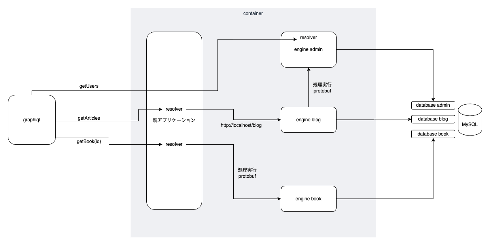

# mountable engineアプリケーション

## バージョン
- ruby: 3.2.0
- rails: 6.1.7
- mysql: 8.0.36

## 概要



- 親アプリケーション: Graphqlのエントリーポイントや、各エンジンへのルーティングを定義
    - railsコマンドは基本的に親アプリケーションのディレクトリで実行する
      - 例）`rails db:create:blog` `rails db:migrate:blog`
    - DB設定は親アプリケーションの`config/database.yml`に記述する
      - multi_dbを使っているので、各エンジンのDB設定は親アプリケーションの`config/database.yml`に記述する
- engineアプリケーション: 親アプリケーションからマウントされる
    - generate系コマンドは各エンジンで実行する
      - 例）`rails g model article title:string content:text` `rails g scaffold articles`
    - Modelは各エンジンのディレクトリに作成される
      - 例）`engine/blog/app/models/blog/article.rb`

## 起動方法

```bash
docker-compose up -d
```

## 停止方法

```bash
docker-compose down
```

## graphiqlでの確認

ブラウザで http://localhost:3000/graphiql にアクセス

### getUsers Query
```graphql
{
  users {
    name
  }
}
```

### getArticles Query
```graphql
{
  articles {
    title
  }
}
```

### getBook(id) Query
```graphql
{
  book(id: 1) {
    title
  }
}
```

## 各テーブルのCRUD

### articles (blog engine)
http://localhost:3000/blog/articles

### users (admin engine)
http://localhost:3000/admin/users

### books (book engine)
http://localhost:3000/book/books
